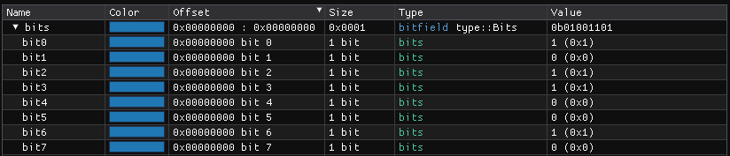
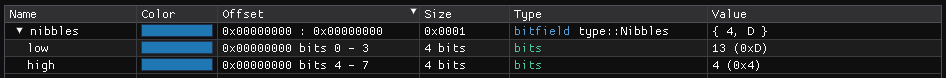
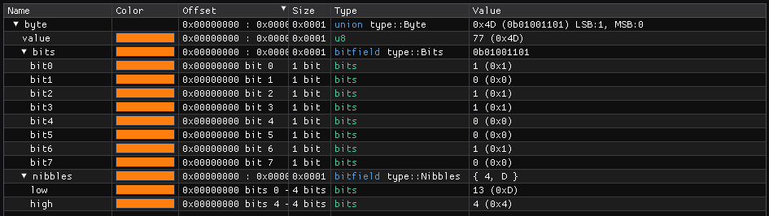

``Byte Types`` :version:`1.20.0`
================================

.. code-block:: hexpat

    #include <type/byte.pat>

| This file contains multiple different types to better visualize individual bytes
|

------------------------

Types
-----

``type::Bits``

**Visualizes the individual bits of a byte as well as the MSB and LSB.**

------------------------

``type::Nibbles``

**Visualizes the two Nibbles of a byte.**

------------------------

``type::Byte``

**A combination of the above types. Visualizes the byte value in Decimal, Hexadecimal and Binary as well as displaying the LSB, MSB and the individual nibbles.**

