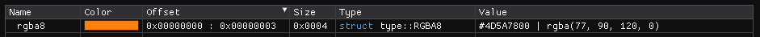
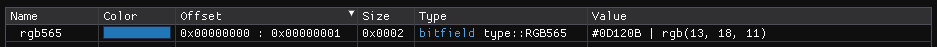
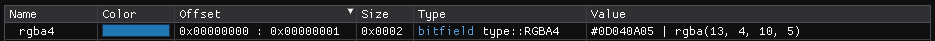

``Color Types`` :version:`1.24.0`
=================================

.. code-block:: hexpat

    #include <type/color.pat>

| This file contains multiple different types to better visualize individual bytes
|

------------------------

Types
-----

``type::RGBA8``

**Visualizes 4 bytes as a RGBA8 color.**

------------------------

``type::RGB565``

**Visualizes 2 bytes as a RGB565 color.**

------------------------

``type::RGBA4``

**Visualizes 2 bytes as a RGBA4 color.**

