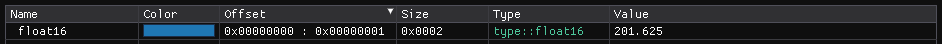

``Float16 Type`` :version:`1.20.0`
==================================

.. code-block:: hexpat

    #include <type/float16.pat>

| This file contains a custom float16 type for decoding half floats.
|

------------------------

Types
-----

``type::float16``

**Visualizes a 2 byte half float.**

