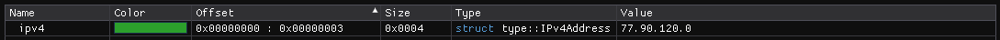
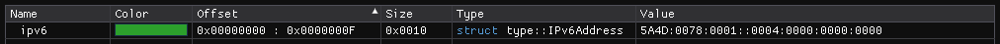

``IP Address Types`` :version:`1.20.0`
======================================

.. code-block:: hexpat

    #include <type/ip.pat>

| This file contains types to visualize RFC 791 IPv4 and RFC 2460 IPv6 addresses
|

------------------------

Types
-----

``type::IPv4Address``

**Visualizes a standard IPv4 address.**

------------------------

``type::IPv6Address``

**Visualizes a standard IPv6 address.**

