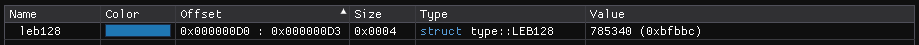
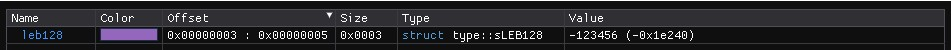

``LEB128 Types`` :version:`1.21.0`
==================================

.. code-block:: hexpat

    #include <type/leb128.pat>

| This file contains a type to visualize LEB128 encoded numbers
|

------------------------

Types
-----

``type::LEB128``, ``type::uLEB128``

**Visualizes a unsigned LEB128 number.**

------------------------

``type::sLEB128``

**Visualizes a signed LEB128 number.**

