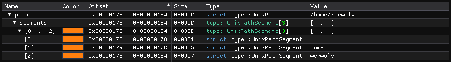

``Path Types`` :version:`1.22.0`
================================

.. code-block:: hexpat

    #include <type/path.pat>

| This file contains types to visualize file paths.
|

------------------------

Types
-----

``type::UnixPath``

**Visualizes a standard Unix file path.**

