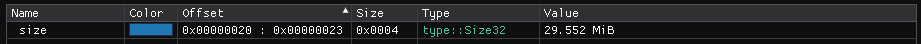

``Size Types`` :version:`1.22.0`
================================

.. code-block:: hexpat

    #include <type/size.pat>

| This file contains types to visualize numbers as a pretty printed number of bytes.
|

------------------------

Types
-----

``type::Size8``

**Visualizes a 8 bit size.**

------------------------

``type::Size16``

**Visualizes a 16 bit size.**

------------------------

``type::Size32``

**Visualizes a 32 bit size.**

------------------------

``type::Size64``

**Visualizes a 64 bit size.**

------------------------

``type::Size128``

**Visualizes a 128 bit size.**

------------------------

