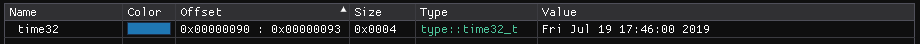

``Time Types`` :version:`1.20.0`
================================

.. code-block:: hexpat

    #include <type/time.pat>

| This file contains types to visualize UNIX epoch time values.
|

------------------------

Types
-----

``type::time32_t``

**Visualizes a 32 bit UNIX epoch time value.**

------------------------

``type::time64_t``

**Visualizes a 64 bit UNIX epoch time value.**

